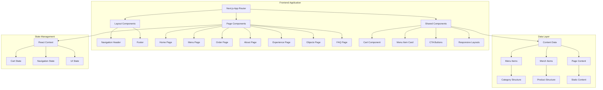

# Design Document: Japanese Fusion Restaurant Website

## Overview

A modern, responsive website for a Japanese fusion restaurant built with Next.js, TypeScript, and Tailwind CSS. The website serves as both a brand platform and online ordering gateway, emphasizing food quality, customer service, and a clean modern aesthetic. The design follows mobile-first principles with client-side routing, reusable components, and a focus on maintainability for long-term scaling.

## Architecture

### Technology Stack
- **Framework**: Next.js 14+ with App Router for server-side rendering and static generation
- **Language**: TypeScript for type safety and developer experience
- **Styling**: Tailwind CSS for utility-first responsive design
- **State Management**: React Context + useState for client-side state (cart, navigation)
- **Routing**: Next.js App Router with client-side navigation
- **Build Tool**: Vite (via Next.js) for fast development and production builds

### System Architecture Diagram



### Backend & Data Layer (for real payments)

- **API Layer**: Next.js Route Handlers (/api) for:
  - creating checkout sessions,
  - receiving payment webhooks,
  - creating/updating order records.
- **Database**: PostgreSQL (via Prisma/Drizzle) for:
  - storing orders,
  - storing payment status,
  - optionally storing menu/merch for future CMS-less operation.
- **Payment Gateway**: (e.g. Stripe / Paytrail / Checkout.com) integrated via:
  - server-side session creation,
  - client-side payment element,
  - webhook handlers for confirmation/failure.

### Key Architectural Decisions

1. **Next.js App Router**: Chosen for built-in routing, server components, and optimal performance with static generation where possible
2. **TypeScript**: Provides type safety for data structures and component props, reducing runtime errors
3. **Tailwind CSS**: Enables rapid prototyping and consistent design system while keeping styles maintainable
4. **Component-Based Architecture**: Reusable components with clear separation of concerns for easy maintenance
5. **Client-Side State Management**: Simple React Context for cart and UI state avoids over-engineering for MVP
6. **Static Content**: Most content stored in TypeScript/JSON files for easy updates without code changes

## Components and Interfaces

### Core Components

#### 1. Layout Components
- **RootLayout**: Main layout with navigation, footer, and global styles
- **NavigationHeader**: Responsive navigation with mobile hamburger menu
- **Footer**: Contact info, hours, and social links
- **PageContainer**: Consistent page wrapper with responsive padding

#### 2. Page Components
- **HomePage**: Hero section, featured items, ordering options, preview sections
- **MenuPage**: Category tabs, menu item grid, filtering/search (optional)
- **OrderPage**: Pickup/delivery selection, hours, service area, ordering methods
- **AboutPage**: Brand story, quality approach, customer service promise
- **ExperiencePage**: Packaging philosophy, travel-well experience, signature elements
- **ObjectsPage**: Product grid for merch items, consistent branding
- **FAQPage**: Contact info, hours, location, common questions

#### 3. Shared Components
- **MenuItemCard**: Displays image, name, description, price, tags, and Add to Order button
- **MerchItemCard**: Similar to MenuItemCard but for merchandise
- **CartComponent**: Floating/mini cart showing selected items, quantities, subtotal
- **CTAButton**: Reusable call-to-action button with variants (primary, secondary)
- **SectionContainer**: Responsive section wrapper with consistent spacing
- **HeroSection**: Full-width hero with background image and CTAs
- **CategoryTabs**: Tab navigation for menu categories
- **AvailabilityBadge**: Indicates sold out/unavailable status
- **ResponsiveImage**: Handles different image sizes for responsive design

### Component Interfaces (TypeScript)

```typescript
// Core data interfaces
interface MenuItem {
  id: string;
  name: string;
  description: string;
  price: number;
  imageUrl: string;
  category: string;
  tags: string[];
  isAvailable: boolean;
  isFeatured?: boolean;
}

interface MerchItem {
  id: string;
  name: string;
  description: string;
  price: number;
  imageUrl: string;
  category: string;
  isInStock: boolean;
}

interface CartItem {
  id: string;
  name: string;
  price: number;
  quantity: number;
  type: 'menu' | 'merch';
}

// Component props interfaces
interface MenuItemCardProps {
  item: MenuItem;
  onAddToCart: (item: MenuItem) => void;
  isMobile?: boolean;
}

interface CartComponentProps {
  items: CartItem[];
  isOpen: boolean;
  onClose: () => void;
  onUpdateQuantity: (id: string, quantity: number) => void;
  onRemoveItem: (id: string) => void;
}

interface NavigationProps {
  currentPage: string;
  cartItemCount: number;
  onCartClick: () => void;
}

interface PageContainerProps {
  children: React.ReactNode;
  className?: string;
}
```

## Data Models

### 1. Menu Data Structure

```typescript
// Menu categories as defined in requirements
type MenuCategory = 
  | 'recommended'
  | 'maki'
  | 'uramaki'
  | 'terimaki'
  | 'sashimi'
  | 'gunkan'
  | 'taco-sushi';

// Menu item with all required fields
interface MenuItem {
  id: string; // Unique identifier
  name: string; // Display name
  description: string; // Detailed description
  price: number; // Price in local currency
  imageUrl: string; // Path to image or placeholder
  category: MenuCategory; // Category for filtering
  tags: string[]; // e.g., ['spicy', 'vegetarian', 'signature']
  isAvailable: boolean; // Availability status
  isFeatured?: boolean; // For homepage display
  preparationTime?: number; // Optional: minutes
  calories?: number; // Optional: for nutrition info
}

// Menu data organized by category
interface MenuData {
  categories: Record<MenuCategory, MenuItem[]>;
  featuredItems: MenuItem[]; // For homepage
}
```

### 2. Merchandise Data Structure

```typescript
// Merch categories
type MerchCategory = 'clothing' | 'accessories' | 'kitchenware';

interface MerchItem {
  id: string;
  name: string;
  description: string;
  price: number;
  imageUrl: string;
  category: MerchCategory;
  isInStock: boolean;
  sizes?: string[]; // For clothing
  colors?: string[]; // For items with color options
}

interface MerchData {
  items: MerchItem[];
}
```

### 3. Restaurant Information

```typescript
interface RestaurantInfo {
  name: string;
  phone: string;
  email: string;
  address: string;
  openingHours: {
    monday: { open: string; close: string };
    tuesday: { open: string; close: string };
    wednesday: { open: string; close: string };
    thursday: { open: string; close: string };
    friday: { open: string; close: string };
    saturday: { open: string; close: string };
    sunday: { open: string; close: string };
  };
  deliveryZones: {
    zone: string;
    estimatedTime: string;
    minimumOrder?: number;
  }[];
  socialMedia: {
    instagram?: string;
    facebook?: string;
    twitter?: string;
  };
}
```

### 4. Cart State

```typescript
interface CartState {
  items: CartItem[];
  subtotal: number;
  taxRate: number;
  taxAmount: number;
  total: number;
  lastUpdated: Date;
}

interface CartItem {
  id: string;
  name: string;
  price: number;
  quantity: number;
  type: 'menu' | 'merch';
  imageUrl?: string; // For display in cart
}
```

### 7. Checkout and Order Data Structures

```typescript
// Customer information for checkout
interface CustomerInfo {
  name: string;
  email: string;
  phone: string;
  deliveryAddress?: string; // Required for delivery
  pickupTime?: string; // Optional for pickup
  specialInstructions?: string;
}

// Payment information
interface PaymentInfo {
  method: 'card' | 'cash' | 'online';
  status: 'pending' | 'processing' | 'completed' | 'failed' | 'refunded';
  transactionId?: string;
  amount: number;
  timestamp: Date;
}

// Order information
interface Order {
  id: string;
  orderNumber: string;
  customer: CustomerInfo;
  items: CartItem[];
  subtotal: number;
  taxAmount: number;
  deliveryFee?: number;
  total: number;
  fulfillmentMethod: 'pickup' | 'delivery';
  status: 'pending' | 'confirmed' | 'preparing' | 'ready' | 'completed' | 'cancelled';
  payment: PaymentInfo;
  createdAt: Date;
  estimatedReadyTime?: Date;
  notes?: string;
}

// Checkout session state
interface CheckoutSession {
  cart: CartState;
  customer: CustomerInfo;
  step: 'customer-info' | 'delivery-address' | 'payment' | 'confirmation';
  errors: Record<string, string>;
  isLoading: boolean;
}
```

### 5. Page Metadata

```typescript
interface PageMetadata {
  title: string;
  description: string;
  keywords: string[];
  openGraph?: {
    title: string;
    description: string;
    image: string;
    type: 'website' | 'article';
  };
}
```

### 6. UI State

```typescript
interface UIState {
  isMobileMenuOpen: boolean;
  isCartOpen: boolean;
  currentPage: string;
  isLoading: boolean;
  error: string | null;
}
```

### Data Storage Strategy

1. **Static Content**: Menu items, merch items, and restaurant info stored in TypeScript/JSON files within the codebase
2. **Client State**: Cart state stored in React Context with session persistence via localStorage
3. **No Database Required**: For MVP, all content is static and editable via code updates
4. **Future Scalability**: Data structures designed to easily migrate to CMS or database later

### Content Organization

```
src/
├── data/
│   ├── menu-items.ts
│   ├── merch-items.ts
│   ├── restaurant-info.ts
│   └── page-content.ts
├── components/
├── pages/
└── styles/
```

This structure allows non-technical users to update content by editing simple TypeScript/JSON files without touching component code.

## Legal and Compliance Pages

### Required Legal Pages

1. **Privacy Policy**
   - Data collection practices
   - Data usage and sharing
   - User rights and controls
   - Contact information for privacy concerns
   - Cookie usage explanation

2. **Terms of Service**
   - Website usage terms
   - Ordering policies
   - Cancellation and refund policies
   - Liability limitations
   - Intellectual property rights

3. **Cookie Policy**
   - Types of cookies used
   - Purpose of each cookie category
   - Cookie consent management
   - Opt-out instructions

4. **Accessibility Statement**
   - Commitment to accessibility
   - Supported accessibility features
   - Contact for accessibility issues
   - Ongoing improvement plans

5. **Allergen Information**
   - Common allergen warnings
   - Cross-contamination disclaimer
   - Detailed allergen information per menu item
   - Contact for specific allergen concerns

## Progressive Web App (PWA) Implementation

### PWA Features

1. **Installation and App-like Experience**
   - Web App Manifest for installation
   - Service Worker for offline functionality
   - App shell architecture for fast loading
   - Splash screen and app icon

2. **Offline Functionality**
   - Cached menu and merch data
   - Offline cart functionality
   - Background sync for orders
   - Offline error handling

3. **Push Notifications**
   - Order status updates
   - Promotional notifications
   - Abandoned cart reminders
   - Custom notification preferences

4. **Performance Optimization for PWA**
   - Pre-caching of critical assets
   - Network-first then cache strategy
   - Background data synchronization
   - Storage management for cached data

## Marketing and Customer Engagement Features

### Social Media Integration

1. **Social Sharing**
   - Share menu items on social platforms
   - Share order confirmations
   - Social media follow buttons
   - User-generated content integration

2. **Social Media Feeds**
   - Instagram feed display
   - Customer review integration
   - Social proof elements
   - Hashtag campaign support

### Email Marketing Integration

1. **Newsletter Signup**
   - Email collection forms
   - Double opt-in confirmation
   - Preference management
   - Unsubscribe functionality

2. **Automated Emails**
   - Order confirmation emails
   - Order status updates
   - Promotional campaigns
   - Abandoned cart reminders

### Customer Reviews and Ratings

1. **Review System**
   - Star rating for menu items
   - Written review submission
   - Review moderation tools
   - Response management

2. **Social Proof Display**
   - Average ratings display
   - Featured reviews
   - Review filtering and sorting
   - Verified purchaser badges

## Checkout and Payment Flow

### Checkout Process Design

1. **Checkout Steps**
   - Step 1: Customer Information (name, email, phone)
   - Step 2: Fulfillment Method Selection (pickup/delivery)
   - Step 3: Delivery Address (if delivery selected)
   - Step 4: Order Review & Summary
   - Step 5: Payment Processing
   - Step 6: Order Confirmation

2. **Payment Gateway Integration**
   - Stripe or similar payment processor
   - Server-side session creation for security
   - Client-side payment elements for PCI compliance
   - Webhook handling for payment confirmation
   - Support for multiple payment methods (card, digital wallets)

3. **Order Management**
   - Real-time order status updates
   - Email/SMS notifications for order confirmation
   - Order history for returning customers
   - Cancellation and refund handling

### Security Considerations for Payments

1. **PCI Compliance**
   - No sensitive payment data stored on servers
   - Tokenized payment processing
   - Secure communication with payment gateway
   - Regular security audits

2. **Fraud Prevention**
   - Address verification system (AVS)
   - CVV verification
   - Rate limiting for payment attempts
   - Suspicious activity monitoring

3. **Data Protection**
   - Encryption of customer information
   - Secure storage of order records
   - Access controls for order data
   - Data retention policies

## Performance Optimization

### Core Web Vitals Strategy

1. **Largest Contentful Paint (LCP) Optimization**
   - Priority loading of hero images and critical content
   - WebP format with responsive sizing for all images
   - Preloading key resources with Next.js `next/image` optimization

2. **First Input Delay (FID) Optimization**
   - Code splitting for non-critical JavaScript
   - Minimized third-party scripts
   - Efficient React component rendering with memoization

3. **Cumulative Layout Shift (CLS) Prevention**
   - Reserved space for images with aspect ratio placeholders
   - Stable navigation and footer layouts
   - Font loading strategy to prevent layout shifts

### Caching and CDN Strategy

1. **Static Asset Caching**
   - Long cache lifetimes for immutable assets (hashed filenames)
   - CDN distribution for global performance
   - Browser caching headers optimized for static content

2. **Dynamic Content Caching**
   - ISR (Incremental Static Regeneration) for menu content
   - Stale-while-revalidate patterns for frequently changing data
   - Edge caching for API responses

### Bundle Optimization

1. **JavaScript Bundle Size**
   - Tree shaking and dead code elimination
   - Dynamic imports for non-critical features
   - Minimal third-party dependencies

2. **CSS Optimization**
   - PurgeCSS with Tailwind for unused styles
   - Critical CSS extraction for above-the-fold content
   - CSS minification and compression

## Security Implementation

### Security Headers and Policies

1. **Content Security Policy (CSP)**
   - Strict CSP configuration to prevent XSS
   - Nonce-based script execution for inline scripts
   - Report-only mode during development

2. **HTTP Security Headers**
   - X-Frame-Options: DENY
   - X-Content-Type-Options: nosniff
   - Referrer-Policy: strict-origin-when-cross-origin
   - Permissions-Policy for camera/microphone/location

### Input Validation and Sanitization

1. **Client-Side Validation**
   - TypeScript type checking for all data structures
   - Form validation with proper error messages
   - Input sanitization for any user-generated content

2. **Server-Side Protection**
   - Request validation middleware
   - Rate limiting for form submissions
   - SQL injection prevention (if database added later)

### Data Protection

1. **Client-Side Data Storage**
   - No sensitive data in localStorage or sessionStorage
   - Secure cookie configuration for any authentication
   - Encryption for any sensitive client-side data

2. **Third-Party Integration Security**
   - Secure API key management
   - Sandboxed iframes for external services
   - Privacy-focused analytics with consent management

## Error Handling

### Client-Side Error Handling

1. **Component-Level Errors**
   - Boundary components catch rendering errors
   - Fallback UI for failed image loads
   - Graceful degradation for missing data

2. **Data Validation**
   - TypeScript interfaces enforce data structure
   - Runtime validation for external data sources
   - Default values for missing optional fields

3. **User Input Errors**
   - Form validation for any input fields
   - Clear error messages near problematic fields
   - Prevent invalid cart operations (negative quantities)

4. **Network/API Errors**
   - Loading states for async operations
   - Retry mechanisms for transient failures
   - Offline detection and messaging

### Error Recovery Strategies

1. **Cart State Recovery**
   - localStorage backup for cart items
   - Session restoration on page reload
   - Conflict resolution for stale data

2. **Image Loading**
   - Placeholder images for failed loads
   - Progressive loading with blur-up technique
   - Fallback to generic food/merch images

3. **Navigation Errors**
   - 404 page for invalid routes
   - Redirects for deprecated URLs
   - Breadcrumb navigation for recovery

### Error Reporting

1. **Development**
   - Console logging with detailed context
   - Error boundaries with component stack
   - TypeScript compile-time errors

2. **Production**
   - User-friendly error messages
   - Minimal technical details exposed
   - Contact information for persistent issues

## Deployment and Monitoring

### Hosting Infrastructure

1. **Primary Hosting Platform**
   - Vercel for Next.js optimized hosting
   - Global CDN with edge network
   - Automatic SSL certificate management
   - Continuous deployment from GitHub/GitLab

2. **Backup and Disaster Recovery**
   - Regular automated backups of content and configuration
   - Multi-region deployment for high availability
   - Failover strategies for critical services

3. **Scalability Configuration**
   - Auto-scaling based on traffic patterns
   - Edge caching for static content
   - Database scaling strategy (if database added)

### Monitoring and Observability

1. **Performance Monitoring**
   - Real User Monitoring (RUM) for Core Web Vitals
   - Synthetic monitoring for uptime checking
   - Error tracking and alerting
   - Performance budget tracking

2. **Business Metrics Monitoring**
   - Conversion rate tracking
   - User flow analysis
   - Popular menu item tracking
   - Cart abandonment analysis

3. **Security Monitoring**
   - Vulnerability scanning
   - Security alerting
   - Access logging and audit trails
   - Compliance monitoring

### Maintenance Procedures

1. **Regular Maintenance Tasks**
   - Dependency updates with security scanning
   - Content updates via structured files
   - Performance optimization reviews
   - Security audit scheduling

2. **Emergency Procedures**
   - Rollback procedures for failed deployments
   - Incident response playbooks
   - Communication protocols for downtime
   - Data recovery procedures

## Testing Strategy

### Dual Testing Approach

The testing strategy employs both unit tests and property-based tests to ensure comprehensive coverage:

1. **Unit Tests**: Verify specific examples, edge cases, and error conditions
2. **Property Tests**: Verify universal properties across all inputs

### Testing Framework Selection

- **Unit Testing**: Vitest (fast, compatible with Vite/Next.js)
- **Property Testing**: fast-check (TypeScript-native property-based testing)
- **Component Testing**: React Testing Library
- **E2E Testing**: Playwright (optional for critical user flows)

### Test Organization

```
tests/
├── unit/
│   ├── components/
│   ├── utils/
│   └── data/
├── property/
│   ├── cart-properties.test.ts
│   ├── menu-properties.test.ts
│   └── ui-properties.test.ts
└── integration/
    └── navigation.test.ts
```

### Property-Based Testing Configuration

Each property test will be configured with:
- Minimum 100 iterations per property test
- Random seed for reproducible failures
- Shrinking to find minimal failing examples
- Tagging with design property references

### Test Coverage Goals

1. **Component Tests**: 80%+ coverage for reusable components
2. **Utility Tests**: 90%+ coverage for data transformation functions
3. **Property Tests**: All correctness properties from design
4. **Integration Tests**: Critical user flows (navigation, cart operations)

### Testing During Development

1. **Pre-commit Hooks**: Run unit tests on staged changes
2. **CI Pipeline**: Run all tests including property tests
3. **Development Workflow**: Tests run on file changes
4. **Property Test Focus**: Run property tests before major refactors

## Correctness Properties

*A property is a characteristic or behavior that should hold true across all valid executions of a system—essentially, a formal statement about what the system should do. Properties serve as the bridge between human-readable specifications and machine-verifiable correctness guarantees.*